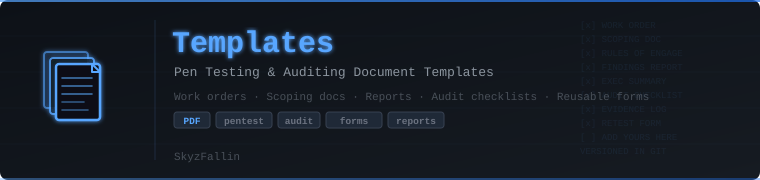

  

  
  
  
  
  
  
  

# Templates — Pen Testing &amp; Auditing Document Templates

By [SkyzFallin](https://github.com/SkyzFallin) | [GitHub Repo](https://github.com/SkyzFallin/Templates)

A small, growing collection of reusable document templates for pen testing, auditing, and the business side of running engagements — work orders, scoping docs, reports, checklists, and forms. Every file is published with metadata scrubbed so you can drop your own branding in without leaking the previous author, machine, or revision history.

## Available Templates

| Template | PDF | DOCX | Description |
|---|---|---|---|
| Printer / Copier Service Work Order | [PDF](Printer_Repair_Workorder_Template.pdf) | [DOCX](Printer_Repair_Workorder_Template.docx) | Single-page service work order for printer / copier repair calls — customer + equipment, reported issue, parts &amp; labor, post-service verification, totals, and signatures. |

## Usage

1. Pick a template from the table above.
2. Open the DOCX in Word / LibreOffice and replace the `[Business Name]` / `[Business Address]` / `[Business Phone Number]` placeholders with your own.
3. Customize fields to fit the engagement.
4. Export to PDF when you're ready to send it.

The PDF copies are provided for reference / printing. The DOCX is the editable source.

## Metadata Hygiene

All files in this repo have been scrubbed of identifying metadata before commit:

**PDF** — `/Author`, `/Title`, `/Subject`, `/Keywords`, `/Producer`, `/Creator`, `/CreationDate`, `/ModDate` all blanked out.

**DOCX** — `core.xml` (author, lastModifiedBy, title, subject, keywords, etc.) blanked, `app.xml` (Application, Company, Manager, AppVersion) blanked, timestamps reset to `2000-01-01T00:00:00Z`, embedded thumbnail removed.

Why this matters: when you take one of these files, edit it, and ship it to a client, your editor will overwrite *its own* metadata fields — but anything left over from a prior author would still be there. Starting from a clean baseline means you only ever leak your own data, not someone else's.

If you fork this repo and add new templates, run them through a metadata stripper (e.g. `exiftool -all= file.pdf`, or open in Word → File → Info → Inspect Document → Remove All) before committing.

## Contributing

Pull requests for new templates are welcome. Guidelines:

- Provide both PDF and DOCX (or PDF only if it's a fillable form).
- Strip metadata before committing — see above.
- Keep placeholders generic (`[Business Name]`, `[Client]`, `[Date]`) so others can drop their own info in.
- One template per PR with a short note in the README table.

## License

MIT — Made by [SkyzFallin](https://github.com/SkyzFallin)
